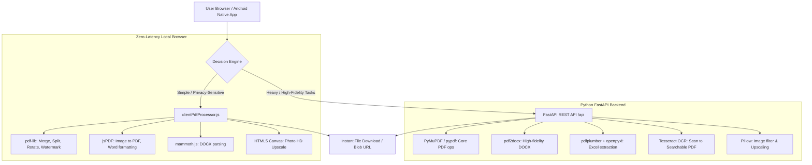

# Product Requirement Document (PRD)
# KlikPDF (SukaPDF Ecosystem)

**Document Version:** 1.0.0  
**Status:** Living Document / Active  
**Author & Product Lead:** Ardiansyah  
**Last Updated:** Oktober 2026  
**Target Platform:** Web (PWA), Android (Capacitor Native APK), iOS (Capacitor)  
**Production Domain:** [klikpdf.my.id](https://klikpdf.my.id)

---

## 1. Executive Summary & Product Vision

### 1.1 Visi Produk
Menjadi ekosistem manajemen dokumen PDF dan berkas digital serbaguna nomor satu di Indonesia yang mengutamakan kecepatan instan (*zero-latency*), privasi dokumen tanpa kompromi (*client-side first*), kemudahan akses multi-platform (Web, Android, iOS), serta antarmuka modern yang memanjakan pengguna tanpa iklan mengganggu (*ad-free clean experience*).

### 1.2 Problem Statement
- **Kekhawatiran Privasi & Keamanan:** Pengguna sering ragu mengunggah dokumen sensitif (KTP, ijazah, kontrak kerja, laporan keuangan) ke situs konverter PDF daring karena berkas disimpan di server pihak ketiga.
- **Ketergantungan Kuota & Latensi Lambat:** Layanan konvensional mengharuskan unggah dan unduh berkas ukuran besar berulang kali, menghabiskan kuota internet dan memakan waktu lama saat koneksi tidak stabil.
- **Pengalaman Pengguna Penuh Hambatan (Friction):** Banyak platform PDF gratis dibanjiri iklan pop-up, batasan unduh harian yang ketat, atau keharusan berlangganan mahal hanya untuk tugas sederhana seperti menggabungkan berkas atau kompresi.
- **Ketiadaan Solusi Terpadu Mobile & Web:** Pengguna mobile sering kali harus mengunduh aplikasi terpisah untuk masing-masing fungsi (kompresor, konverter, scanner OCR).

### 1.3 Value Proposition KlikPDF
1. **Hybrid Processing Engine:**
   - **Client-Side Instant Engine:** Pemrosesan lokal di browser via WebAssembly & JavaScript (`pdf-lib`, `jspdf`, `mammoth`, HTML5 Canvas) untuk operasi cepat, 100% aman tanpa unggah ke server, dan hemat kuota.
   - **Serverless Cloud Engine Fallback:** Python FastAPI Microservices (`pymupdf`, `pdf2docx`, `pdfplumber`, `pytesseract`) yang aktif otomatis untuk kebutuhan kompleks seperti OCR multi-bahasa, ekstraksi tabel Excel, dan konversi dokumen fidelitas tinggi.
2. **True Cross-Platform Native:** Satu basis kode modern (React 18 + Vite + Tailwind CSS) yang dikemas menjadi Progressive Web App (PWA) dan aplikasi native Android/iOS melalui Capacitor.
3. **Smart AI Assistant Widget:** Asisten interaktif cerdas di dalam aplikasi untuk memandu pengguna memilih alat yang tepat berdasarkan keluhan/kebutuhan dokumen secara langsung.
4. **Desain Modern Kelas Dunia:** Desain bertaraf internasional yang terinspirasi oleh sistem desain aura.build: mode Gelap/Terang adaptif, aksen visual elegan, dan animasi mikro responsif.

---

## 2. Target Audience & User Personas

| Persona | Profil & Kebutuhan Utama | Fitur Kunci yang Digunakan |
| :--- | :--- | :--- |
| **Pelamar Kerja & Fresh Graduate** | Membutuhkan penggabungan berkas lamaran, surat lamaran kerja, CV, sertifikat, serta kompresi dokumen di bawah 200–500 KB sesuai syarat portal BUMN/CPNS. | Merge PDF, Compress PDF, Word to PDF, Image to PDF, HD Photo Enhancer. |
| **Mahasiswa & Pelajar** | Membutuhkan ekstraksi halaman tugas tertentu, konversi bahan ajar PDF ke Word untuk dikutip, dan scan OCR catatan kuliah. | Split PDF, PDF to Word, OCR PDF, Page Numbers, Watermark. |
| **Profesional Kantor / Admin Keuangan** | Membutuhkan ekstraksi data tabel laporan keuangan ke lembar kerja Excel, mengamankan dokumen dengan sandi, atau membubuhkan watermark hak cipta/draft. | PDF to Excel, Protect PDF, Unlock PDF, Watermark, Merge PDF. |
| **Pengguna Mobile On-the-Go** | Mengakses via smartphone dengan koneksi seluler; menginginkan aplikasi ringan yang bisa dipakai secara offline tanpa hambatan iklan. | PWA / Android APK, Client-side Processing, Mode Offline. |

---

## 3. Product Architecture & Technical Stack

### 3.1 Arsitektur Sistem Hybrid



### 3.2 Tech Stack Overview
- **Frontend Core:** React 18, Vite 5, Tailwind CSS 3.4, Lucide React Icons.
- **Mobile Container:** Capacitor 8.5 (Android Studio integration, Native APK bundle, dark splash screen, native status bar).
- **Client-Side PDF Engines:** `pdf-lib` (v1.17), `jspdf` (v4.2), `mammoth` (v1.13), `pdfjs-dist` (v3.11).
- **Backend Core:** Python 3.12, FastAPI, Uvicorn, Python-Multipart.
- **Backend Libraries:** `PyMuPDF (fitz)`, `pypdf`, `pdf2docx`, `python-docx`, `pdfplumber`, `openpyxl`, `Pillow`, `pytesseract`, `reportlab`.
- **Authentication:** Google Identity Services (`@react-oauth/google`), JWT Decode, Local Guest & Demo profiles.
- **Hosting & Infrastructure:** Vercel Serverless Architecture (Rewrites routing, HSTS, security headers, edge assets), GitHub Actions CI/CD.

---

## 4. Feature Specifications & Tool Directory

KlikPDF menyediakan 15 alat produktivitas dokumen yang dikelompokkan ke dalam 4 kategori utama:

### 4.1 Kategori 1: Atur & Kelola (Organize)
1. **Gabungkan PDF (Merge PDF)**
   - *Deskripsi:* Menggabungkan dua atau lebih berkas PDF menjadi satu dokumen berurutan.
   - *Fitur:* Drag-and-drop urutan berkas, pratinjau thumbnail halaman, tombol geser atas/bawah.
   - *Engine:* Client-side `clientMergePdfs` via `pdf-lib` dengan fallback backend `/api/merge`.
2. **Pisahkan PDF (Split PDF)**
   - *Deskripsi:* Memisahkan dokumen PDF berdasarkan halaman tertentu atau rentang halaman (misal: `1-3, 5, 8-10`).
   - *Fitur:* Mode ekstraksi rentang (*range selection*) atau pemecahan tiap halaman menjadi paket `.zip`.
   - *Engine:* Client-side `clientSplitPdf` dengan fallback backend `/api/split`.
3. **Putar PDF (Rotate PDF)**
   - *Deskripsi:* Memutar orientasi halaman PDF 90°, 180°, atau 270° searah jarum jam.
   - *Fitur:* Rotasi interaktif per dokumen dengan pratinjau real-time.
   - *Engine:* Client-side `clientRotatePdf` via `pdf-lib` dengan fallback backend `/api/rotate`.

### 4.2 Kategori 2: Konversi (Convert)
4. **Word ke PDF (Word to PDF)**
   - *Deskripsi:* Mengubah berkas Microsoft Word (`.docx`, `.doc`) menjadi PDF berkualitas tinggi.
   - *Fitur:* Konversi instan offline tanpa batas via browser Mammoth + jsPDF, dengan layout bersih dan penomoran otomatis.
   - *Engine:* Client-side `clientWordToPdf` & serverless endpoint `/api/word-to-pdf`.
5. **PDF ke Word (PDF to Word)**
   - *Deskripsi:* Mengonversi berkas PDF menjadi dokumen Word (`.docx`) yang dapat diedit dengan tetap mempertahankan tata letak teks dan paragraf.
   - *Engine:* Backend microservice `/api/pdf-to-word` memanfaatkan `pdf2docx`.
6. **PDF ke Excel (PDF to Excel)**
   - *Deskripsi:* Mengekstraksi struktur tabel di dalam PDF menjadi lembar kerja spreadsheet Excel (`.xlsx`).
   - *Engine:* Backend microservice `/api/pdf-to-excel` memanfaatkan `pdfplumber` dan `openpyxl`.
7. **PDF ke Gambar (PDF to JPG/PNG)**
   - *Deskripsi:* Merender setiap halaman berkas PDF menjadi berkas gambar beresolusi tinggi (PNG/JPG) yang diunduh dalam bentuk arsip ZIP.
   - *Engine:* Backend microservice `/api/pdf-to-image` via `PyMuPDF`.
8. **Gambar ke PDF (JPG/PNG to PDF)**
   - *Deskripsi:* Mengonversi satu atau banyak gambar menjadi satu dokumen PDF rapi dengan orientasi dan margin proporsional.
   - *Engine:* Client-side `clientImageToPdf` via `jsPDF` dengan fallback backend `/api/image-to-pdf`.
9. **HD-kan Foto / Image Upscaler (Enhance Photo HD)**
   - *Deskripsi:* Meningkatkan ketajaman, kontras warna, dan resolusi gambar menjadi 2x hingga 4x lebih jernih.
   - *Engine:* Client-side HTML5 Canvas pixel buffer unsharp mask + Backend `/api/enhance-image` via Pillow adaptive filter.

### 4.3 Kategori 3: Optimasi & Keamanan (Optimize & Security)
10. **Kompres PDF (Compress PDF)**
    - *Deskripsi:* Memperkecil ukuran berkas PDF secara drastis tanpa mengurangi keterbacaan teks dan visual.
    - *Tingkat Kompresi:* Rendah (kualitas maksimal), Sedang (rekomendasi terbaik), Ekstrem (ukuran terkecil).
    - *Engine:* Backend microservice `/api/compress` via PyMuPDF stream optimization.
11. **Kunci PDF (Protect PDF)**
    - *Deskripsi:* Memberikan enkripsi kata sandi kuat (AES) pada dokumen PDF sehingga tidak dapat dibuka tanpa sandi yang benar.
    - *Engine:* Backend microservice `/api/protect` via `pypdf`.
12. **Buka Sandi PDF (Unlock PDF)**
    - *Deskripsi:* Menghilangkan kata sandi pemilik/pengguna dari dokumen PDF terenkripsi (setelah memasukkan kata sandi yang sah).
    - *Engine:* Backend microservice `/api/unlock` via `pypdf`.

### 4.4 Kategori 4: Sunting & Ekstraksi Lanjutan (Edit & Advanced)
13. **Cap Air (Watermark PDF)**
    - *Deskripsi:* Menempelkan stempel teks kustom dengan sudut 45 derajat dan transparansi elegan untuk perlindungan hak cipta atau tanda status dokumen (misal: "DRAFT", "CONFIDENTIAL", "LUNAS").
    - *Engine:* Client-side `clientWatermarkPdf` via `pdf-lib` embedding Helvetica-Bold.
14. **Nomor Halaman (Page Numbers)**
    - *Deskripsi:* Membubuhkan nomor halaman otomatis dengan penempatan fleksibel (bawah tengah, bawah kanan, dll.) dan font proporsional.
    - *Engine:* Backend microservice `/api/page-numbers` via PyMuPDF / ReportLab.
15. **PDF OCR (Optical Character Recognition)**
    - *Deskripsi:* Memindai dokumen hasil foto/scanner fisik dan mengubah gambar teks mati menjadi teks dokumen yang dapat dicari (*searchable*), disalin (*selectable*), dan diindeks.
    - *Engine:* Backend microservice `/api/ocr` via Tesseract OCR engine (bahasa Indonesia `ind` + Inggris `eng`).

---

## 5. Supporting Ecosystem & Modules

### 5.1 Asisten Cerdas (KlikPDF AI Chatbot Widget)
- Menggunakan engine berbasis aturan & semantik NLP ringan (*rule-based intelligent matcher*) tanpa biaya token pihak ketiga yang mahal.
- Mampu mendeteksi intensi pengguna dalam bahasa Indonesia dan Inggris (misal: "mau kecilin berkas lamaran", "gabungin ijazah dan transkrip", "apakah data saya aman?").
- Memberikan tombol navigasi langsung (*quick action chip*) ke alat yang bersangkutan hanya dalam satu klik.

### 5.2 Autentikasi Pengguna & Riwayat Berkas
- **Google OAuth 2.0 Integration:** Memungkinkan pengguna masuk dengan akun Google secara aman tanpa perlu mengingat kata sandi baru.
- **Demo & Guest Session:** Akses instan bagi pengguna yang ingin langsung mencoba fitur tanpa registrasi.
- **Recent Files Ledger:** Menyimpan riwayat 20 berkas terakhir yang diproses di penyimpanan lokal perangkat (*client-side LocalStorage*), menjaga privasi penuh tanpa mengunggah data histori ke server.

### 5.3 Portal Administrasi & Monitoring (Admin Dashboard)
- Akses terlindungi otentikasi sandi khusus admin.
- **Master Kill-Switch:** Tombol darurat untuk mengubah status sistem menjadi mode *Maintenance / Offline* secara global.
- **Telemetri & Kesehatan API:** Fitur uji ping latensi server real-time, pantauan storage sesi, dan manajemen ulasan pengguna.

### 5.4 Mesin SEO & Keterbacaan Mesin AI (AEO / GEO)
- Metadata OpenGraph, Twitter Cards, dan Schema.org JSON-LD lengkap untuk optimasi mesin pencari Google.
- File discovery khusus agen kecerdasan buatan:
  - `/llms.txt`: Dokumentasi ringkas untuk Large Language Models yang mengindeks kemampuan KlikPDF.
  - `/ai-catalog.json`: Format JSON katalog terstruktur untuk integrasi API dan asisten AI.
  - `/sitemap.xml`: Peta situs XML terindeks otomatis.

---

## 6. Non-Functional Requirements (NFRs)

### 6.1 Performa & Efisiensi
- **First Contentful Paint (FCP):** < 1.0 detik pada koneksi 4G standar.
- **Client-Side Processing Speed:** Operasi PDF standar (gabung, putar, watermark) selesai dalam < 1.5 detik untuk berkas di bawah 25 MB.
- **PWA Caching:** Service Worker menggunakan strategi *Network-First for HTML* dan *Cache-First for Static Assets*, memastikan pemuatan instan saat halaman dibuka kembali.

### 6.2 Keamanan & Privasi
- **Zero Data Retention Policy:** Seluruh pemrosesan client-side tidak pernah meninggalkan peramban pengguna. Berkas sementara pada pemrosesan server backend otomatis dibersihkan dalam direktori isolasi berbasis UUID sesi.
- **Security Headers:** Dilengkapi HTTP headers ketat (`Strict-Transport-Security`, `X-Content-Type-Options: nosniff`, `X-Frame-Options: SAMEORIGIN`, `X-XSS-Protection`).

### 6.3 Kompatibilitas Multi-Platform
- **Desktop:** Google Chrome, Mozilla Firefox, Microsoft Edge, Apple Safari.
- **Mobile Web:** Chrome Mobile, Safari iOS, Samsung Internet.
- **Mobile Native:** Android 8.0+ (API Level 26+) dengan dukungan adaptive icon, splash screen terintegrasi, dan edge-to-edge layout.

---

## 7. Product Development Roadmap

```mermaid
flowchart LR
    subgraph Phase 1 [Phase 1: Foundation - COMPLETED]
        P1A[15 Core Tools]
        P1B[Client-First Architecture]
        P1C[Capacitor Native Android APK]
        P1D[Aura UI Redesign]
    end

    subgraph Phase 2 [Phase 2: Growth & Productivity - CURRENT]
        P2A[Advanced Batch Processing]
        P2B[Digital Signature / E-Sign]
        P2C[Enhanced OCR with Layout Preserve]
        P2D[PWA Background Sync]
    end

    subgraph Phase 3 [Phase 3: Ecosystem & Monetization - FUTURE]
        P3A[Cloud Storage Sync: Drive / Dropbox]
        P3B[KlikPDF Desktop App: Electron / Tauri]
        P3C[Team Workspace & Shared Folders]
        P3D[API Public for Developers]
    end

    Phase 1 --> Phase 2 --> Phase 3
```

---

## 8. Deployment Protocol & Automated Pipeline

Sesuai aturan operasional proyek (`AGENTS.md`):
1. **Verifikasi Build:** Setiap perubahan diuji melalui `npm run build` di lingkungan frontend untuk memastikan zero syntax/bundle errors.
2. **Commit & Push Otomatis:** Git commit deskriptif segera dijalankan dan di-push ke branch `main`.
3. **CI/CD Auto-Deploy:** Integrasi Vercel Webhook dan GitHub Actions mendistribusikan kode terbaru ke domain produksi `klikpdf.my.id` secara instan tanpa intervensi manual.
